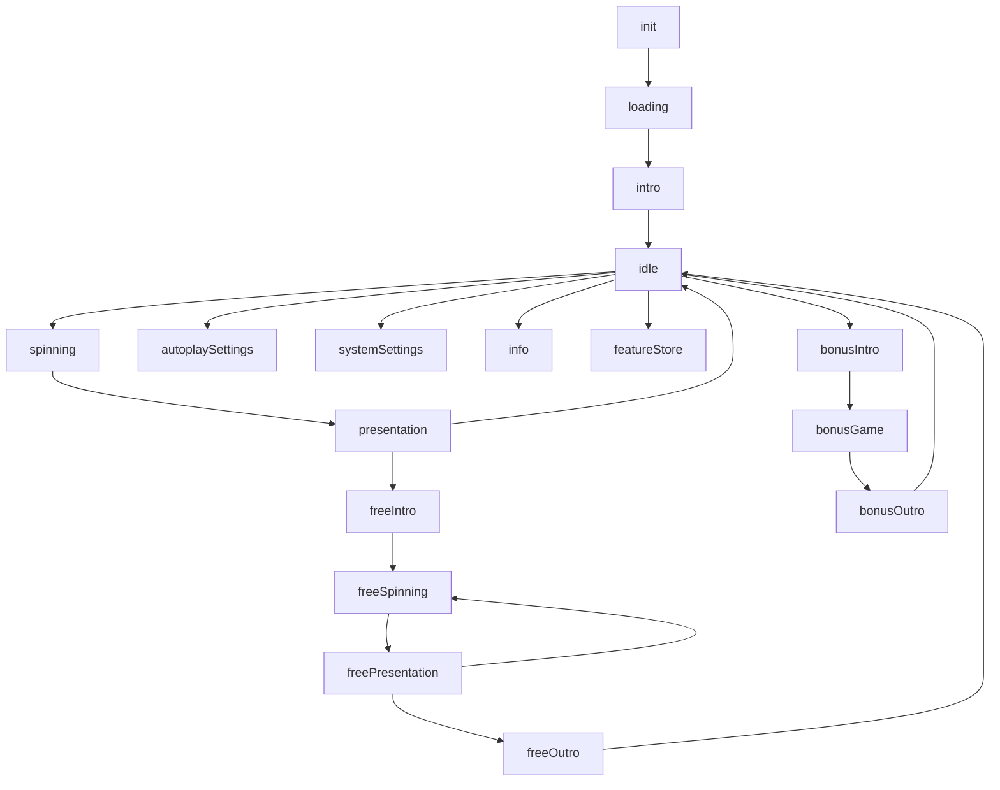
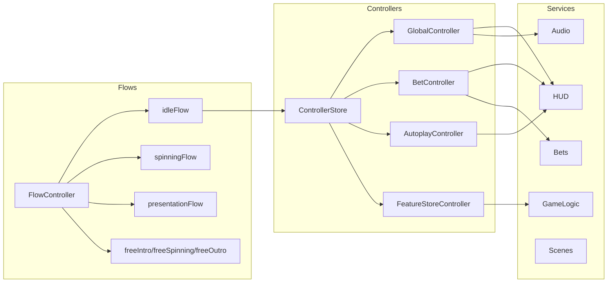

# Архитектура: async flows + controller store

Документ описывает архитектуру управления состояниями слота: асинхронные флоу как оркестрация и контроллеры как фоновые реактивные сервисы. Цель: минимальная сложность, быстрые изменения, расширяемость без тяжёлой FSM.

## Референсная реализация

Полная рабочая реализация архитектуры с автоочисткой ресурсов и детальной документацией:
**[sweet-bonanza/src/gameFlow.ts](https://github.com/demansn/sweet-bonanza/blob/main/src/gameFlow.ts)**

Ключевые особенности реализации:
- BaseFlow с автоматической очисткой подписок через `onDispose()`
- Встроенный `createSkipController()` с обработкой autoplay
- Все flows как классы для лучшей типизации
- Композиция через наследование (FreeSpinPresentationFlow extends PresentationFlow)
- Сгруппированные интерфейсы HUD (display, buttons, popups)
- ControllerStore для фоновых реактивных контроллеров

## Что решаем

- Минимизируем сложность `idle` и остальных состояний.
- Разделяем «что делать дальше» и «как синхронизировать данные».
- Упрощаем добавление новых окон/фич без каскада переходов.

## Идея

- **Flow**: асинхронная последовательность, ждёт событий (input/анимации/сервер) и возвращает следующий шаг.
- **Controller**: подписки на UI/сервисы, поддержка данных, валидации, фоновые правила.
- **ControllerStore**: включает/выключает наборы контроллеров. Могут жить всегда, если не удалять.

## Компоненты

- `FlowController`: цикл `while` по ключам флоу.
- `waitSignal / waitCommand`: ожидание событий, `Promise.race` для выхода.
- `ControllerStore`: add/remove.
- **GlobalController**: звук, mute, fullscreen, spinType UI.
- **Local controllers**: bets, autoplay, feature-store, info/settings UI.

## Диаграммы

## Правила работы флоу

1. Флоу делает минимум: ожидает `await` и возвращает следующий шаг.
2. Только флоу решает «куда перейти».
3. Данные и UI‑состояния живут в контроллерах.
4. Контроллеры не переходят между флоу напрямую.

## Упрощение idle

Идея: `idleFlow` ждёт только «выходные» команды (spin/autoplay/settings/info/featureStore). Всё остальное (изменения ставок, переключатели, локальная логика) уходит в `BetController` и подобные.

- выходы: `spin`, `autoplaySettings`, `systemSettings`, `info`, `featureStore`
- мутации: `betPlus`, `betMinus`, `coinPlus`, `coinMinus`, `toggleDoubleChance`, `betMax`, `stopAutoplay`

## ControllerStore

Паттерн: хранит активные контроллеры и выключает их при деактивации.

- `add(id, controller)`
- `remove(id)` — не трогает `pin`
