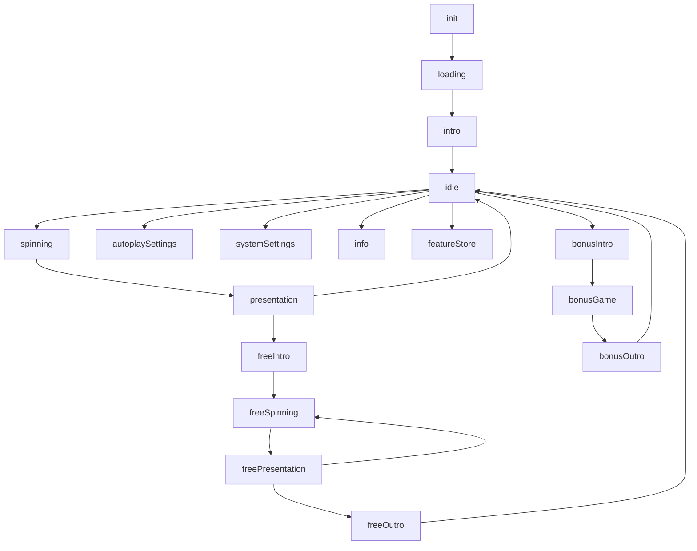
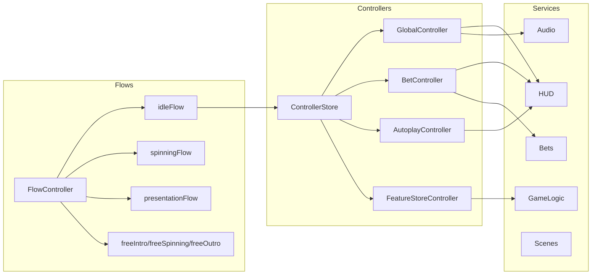

# Архитектура: async flows + controller store

Документ описывает архитектуру управления состояниями слота: асинхронные флоу как оркестрация и контроллеры как фоновые реактивные сервисы. Цель: минимальная сложность, быстрые изменения, расширяемость без тяжёлой FSM.

## Реализовано в движке

Базовая flow-инфраструктура интегрирована в `modules/engine/flow/`:

| Файл | Описание |
|------|----------|
| `flow/BaseFlow.js` | Базовый класс: `run()`, `execute()`, `onDispose()`, `dispose()`, `delay()` |
| `flow/ControllerStore.js` | Сервис (extends Service), доступен через `services.get("controllerStore")` |
| `flow/gameFlowLoop.js` | `gameFlowLoop(ctx, FirstFlow)` — цикл `while` по flows |
| `flow/index.js` | Реэкспорт |

**Game.js** поддерживает flow-режим: `Game.start({ flow: MyFlow })` вместо `{ states, initState }`.

**Контекст (ctx)**: формируется через `services.getAll()` — плоский объект со всеми зарегистрированными сервисами. Во flow доступ через `this.ctx.app`, `this.ctx.resources` и т.д.

**Не реализовано**: `createSkipController()` — будет добавлен при реализации slots-специфичных flows.

## Референсная реализация

Полная рабочая реализация slot-специфичных flows с типами и документацией:
**[gameFlow.ts](gameFlow.ts)** (в корне проекта, TypeScript-референс)

Ключевые особенности:
- Все slot flows как классы (IdleFlow, SpinningFlow, PresentationFlow и т.д.)
- `createSkipController()` с обработкой autoplay
- Композиция через наследование (FreeSpinPresentationFlow extends PresentationFlow)
- Сгруппированные интерфейсы HUD (display, buttons, popups)
- ControllerStore для фоновых реактивных контроллеров

## Что решаем

- Минимизируем сложность `idle` и остальных состояний.
- Разделяем «что делать дальше» и «как синхронизировать данные».
- Упрощаем добавление новых окон/фич без каскада переходов.

## Идея

- **Flow**: асинхронная последовательность, ждёт событий (input/анимации/сервер) и возвращает следующий шаг.
- **Controller**: подписки на UI/сервисы, поддержка данных, валидации, фоновые правила.
- **ControllerStore**: включает/выключает наборы контроллеров. Могут жить всегда, если не удалять.

## Компоненты

- `gameFlowLoop`: цикл `while` по flows (реализован в движке).
- `BaseFlow`: базовый класс с `run()`, `execute()`, `onDispose()` (реализован в движке).
- `ControllerStore`: add/remove/get/clear — сервис движка (реализован).
- `waitSignal / waitCommand`: ожидание событий, `Promise.race` для выхода.
- **GlobalController**: звук, mute, fullscreen, spinType UI.
- **Local controllers**: bets, autoplay, feature-store, info/settings UI.

## Диаграммы





## Правила работы флоу

1. Флоу делает минимум: ожидает `await` и возвращает следующий шаг.
2. Только флоу решает «куда перейти».
3. Данные и UI‑состояния живут в контроллерах.
4. Контроллеры не переходят между флоу напрямую.

## Акты (Presentation Acts)

Презентация результатов спина использует существующую систему актов (`PresentationAct` → `AsyncAction` → `AsyncActionsScenario`). Flow **оркестрирует** акты, но не заменяет их.

### Принцип

- Каждый шаг презентации (stop reels, pays, cascade, multiplier) — это `PresentationAct`
- **Конфиг** — мапа `{ type: ActClass }`, определяет какой класс отвечает за какой тип шага
- **Данные** — массив `result.results` с сервера, определяет порядок выполнения
- `PresentationFlow` итерирует данные, для каждого шага берёт класс из мапы по `step.type`
- Игра может заменить акт для любого типа шага без изменения flow

### Конфиг актов (мапа)

```javascript
// В конфиге игры — какой класс за какой тип отвечает
const presentationActs = {
    stop: StopReelsAct,
    pays: PaysAct,
    cascade: CascadeAct,
    multiplier: MultiplierAct,
    freeSpinsTrigger: FreeSpinsTriggerAct,
    freeSpinsRetrigger: FreeSpinsRetriggerAct,
};

// При создании контекста
const ctx = {
    // ...сервисы
    presentationActs,           // акты для base game
    freeSpinPresentationActs,   // акты для free spins (опционально, fallback к presentationActs)
};
```

### Данные (массив с сервера)

```javascript
// result.results — порядок определяется сервером
[
    { type: "stop", matrix: [...] },
    { type: "pays", pays: [...], win: 100 },
    { type: "cascade", newSymbols: [...] },
    { type: "pays", pays: [...], win: 50 },     // может повторяться
    { type: "multiplier", multipliers: [...] },
    { type: "freeSpinsTrigger", freeSpins: 10 },
]
```

### Как PresentationFlow использует акты

```javascript
class PresentationFlow extends BaseFlow {
    async run() {
        const actMap = this.getActMap();

        // Собираем массив актов по данным — порядок из result.results
        const acts = this.params.result.results
            .map(step => {
                const ActClass = actMap[step.type];
                return ActClass ? new ActClass(this.ctx, step) : null;
            })
            .filter(Boolean);

        const scenario = new AsyncActionsScenario(acts);

        // skipController интегрируется с scenario
        this.skipController.onSkip.then(() => scenario.skipAllIfPossible());

        scenario.start();
        await scenario.onComplete;

        return this.routeNext();
    }
}
```

### Преимущества

- **Конфигурируемость**: игра определяет какой класс за какой тип шага отвечает
- **Порядок из данных**: сервер определяет последовательность шагов, клиент не хардкодит порядок
- **Переиспользование**: существующие акты (`StopReelsAct`, `PaysAct` и т.д.) работают без изменений
- **Guard/Skip**: механизм `guard` и `skipStep` актов сохраняется полностью
- **Нет терминальных актов**: `GoToNextStateAct` больше не нужен — переходы делает flow через `return new NextFlow()`

## Упрощение idle

Идея: `idleFlow` ждёт только «выходные» команды (spin/autoplay/settings/info/featureStore). Всё остальное (изменения ставок, переключатели, локальная логика) уходит в `BetController` и подобные.

- выходы: `spin`, `autoplaySettings`, `systemSettings`, `info`, `featureStore`
- мутации: `betPlus`, `betMinus`, `coinPlus`, `coinMinus`, `toggleDoubleChance`, `betMax`, `stopAutoplay`

## ControllerStore

Паттерн: хранит активные контроллеры и выключает их при деактивации.

- `add(id, controller)`
- `remove(id)` — не трогает `pin`
